# Laravel: Deep(er) Dive

### Overview

This lesson will deepen students' understanding of Laravel's model layer. In particular, it will cover:

1. [Eloquent models](https://laravel.com/docs/5.2/eloquent) and the [query builder](https://laravel.com/docs/5.2/queries);

2. [Relationships](https://laravel.com/docs/5.1/eloquent-relationships); and

3. More details of forms.

#### Instructor Priorities

* The primary objective of today's class is to ensure that students are comfortable with every layer of Laravel's MVC architecture. In particular, they should be able to fluently:

  1. Link forms to controllers; and 

  2. Create models with the submitted information.

* Students get generous amounts of time to work on the day's activities. The app they build through the class is very similar to the homework assignment, so it's important to ensure every student understands the solutions every step of the way.

#### Instructor Notes

* Solutions to today's activities are distributed as ZIP files. These include everything in the Laravel project directory except for `vendor`.

* As has been the trend this week, today's lesson will be dense. If you find yourself pressed for time, consider the section on Database Seeding **optional**. You can abbreviate this portion either by demonstrating it; or skipping it entirely, and instead discussing the concept at a high level, discussing the Artisan directives, and slacking the solution file to students as a starting point for the following exercises.

* Have your TAs reference the [20.3-TimeTracker.xlsx](20.3-TimeTracker.xlsx) to keep track of time.

### Class Objectives

* To develop familiarity with basic relationships in Eloquent;

* To develop fluency with the query builder syntax;

* To understand the advantages of, and apply, eager loading; and

* To develop comfort linking Laravel's MVC layers to one another.

### 1. Instructor Do: Welcome Students & Review Forms (10 min.)

* The solutions to the review questions are in [0-Review/solutions.txt](Activities/0-Review/solutions.txt).

* Take a moment to welcome students, and open the completed user form from last class, in `resources/views/users/create.blade.php`.

* In split-screen, open the controller for the form, in `app/Http/Controllers/UsersController.php`.

* Review the controller solution, and call on different students to explain the following points:

  * How does Laravel know which method to call?

  * What HTTP method is associated with our `create` method? 

  * It's a `GET` method that triggers the `create` method. But `GET` can trigger `show` or `edit`, as well. what indicates that we want `create`?

  * How do we call the `store` method?

* Review the answers to these questions, and slack out [0-Review/solutions.txt](Activities/0-Review/solutions.txt) for student reference.

* Call attention to the `{{ csrf_field() }}` syntax. Explain that CSRF is a way for attackers to send requests with an authenticated user's credentials, and that this function prevents that.

  * It's enough to explain that it's possible to use the fact that a user is logged in to their bank account in one tab to withdraw funds when they hit a malicious site in another.

* Explain that omitting this is not only an inexcusable security mistake, but also breaks the route. 

### 2. Everyone Do: Database Seeding (15 min.)

* Point out that creating users is only half the battle. We need to be able to retrieve them for the database to be useful.

* Before we do that, though, we'll need some data to work with.

* Explain that, rather than waste time manually creating a bunch of users, we'll use something called database seeding to do it programatically.

* Explain that this is just the process of filling up our database with mock data—it's the database equivalent of Lorem Ipsum.

* Explain that we'll also walk through setting up the database settings.

* Have students follow along as you do the following:

  * Create a new Laravel project and Git repo.

  * Open `.env` and comment out the DB variables. 

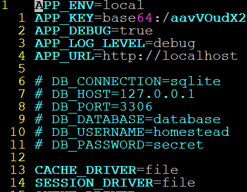

_.env file._

* We should be using DotEnv properly, but it's complicated configuration in the past. Here, we exploit default settings in `config/database.php` for the sake of expediency.

  * Open `config/database.php`.

  * In the section for Default Database Connection Name (ca. line 29), change the second argument in `env` to from `'mysql'` to `'sqlite'`.

    * Explain that this line sets the _default_ database connection to `sqlite`.

    * Explain that `env()` is a function that takes the name of one of the variables in `.env` as its first argument; and a default to return if a variable of that name doesn't exist.

    * We commented out the definition of `DB_CONNECTION`. So, Laravel wil use the default value we provided—sqlite.

    * Finally, from the project root, run: `touch database/database.sqlite`.


_Database configuration._


_Database configuration._

* That's it for database setup.

  * Run your User migrations.

  * Run: `php artisan make:seeder UsersTableSeeder`. 

  * Open the seeder: `database/seeds/UsersTableSeeder`.

  * Add `use App\User;` right before your class declaration.

  * In `run`, add: `factory(User::class, 50)->create()`.

    * Explain that `factory(class, number)` saves `number` instances of `class` to the database.

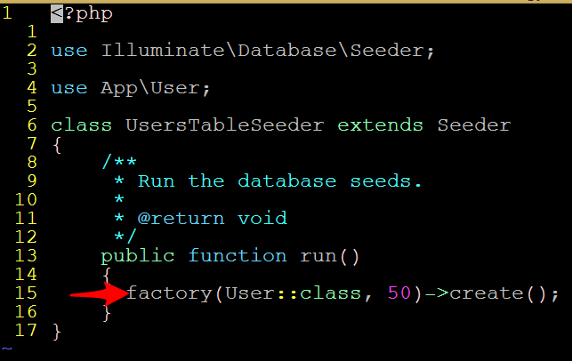

_UsersTableSeeder._

* Open `database/seeds/DatabaseSeeder.php` and uncomment the line in its `run` method.

* Explain you'll have to add a similar line for your custom seeders.


_DatabaseSeeder._

* Run: `php artisan db:seed`.

* Run: `php artisan tinker`, and then: `App\User::find(1)`.

* We'll see this syntax momentarily. For now, just recognize that we retrieved a value from a brand new database, which Laravel seeded with mock data for us!

* Encourage students to do this for all of their custom models to aid in testing.

### 3. Everyone Do: Tinkering with Models (10 min.)

* Have students work along as you continue with the following steps.

* Scaffold a Users resource controller: `php artisan make:controller UsersController --resource`

* Add this to your `routes.php`.


_routes.php with resource controller._

* Create a new folder for user views: `mkdir resources/views/users`

* Create a new template for listing all users, as `index.blade.php`.

  * Don't bother styling the template. Keep it simple. 

* Ask a student how you would create a loop displaying a list of username, given a list of users. Write this loop.

* Ask a student which controller method is responsible for this template.


_users/index.blade.php._

* Open `UsersController`. Be sure to `use App\User` at the top.

  * Explain that this makes the User class available in our controller.

  * Explain that this `use` statement tells Laravel that, whenever you write `User`, you're referring to the file `User.php` in the `app` directory.

  * Explain that PHP organizes files using _namespaces_, which are analogous to referring to files within folder hierarchies.


* Ask a student how we return the index view we created.

* Demonstrate how to store all users in a variable: `$users = User::all()`.

  * Explain that this retrieves all User objects from the database.

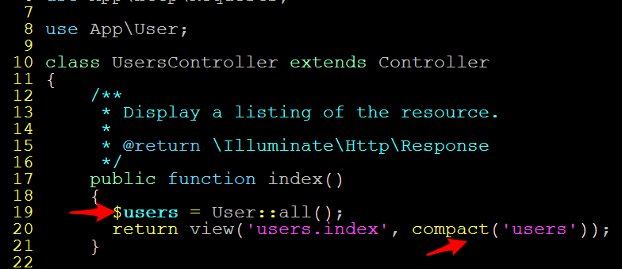

_Bringing App\\User into scope, and retrieving all users from the database._

* Ask a student how to pass this list to the template.

* Serve the site; hit the index view; and demonstrate that everything works as expected.

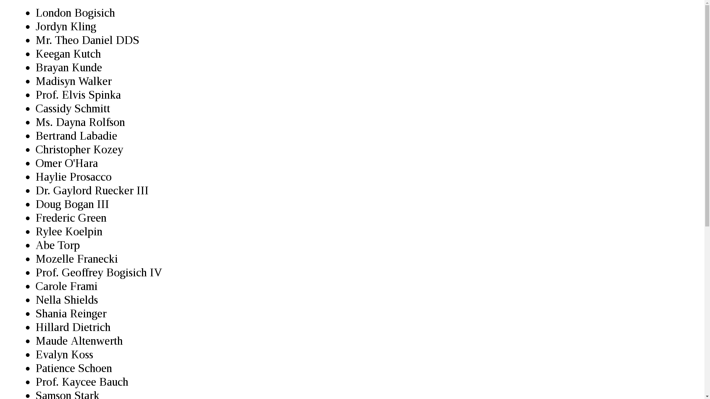

_A bare-bones users list._

- - -

### 4. Partners Do: Display User Details (20 min.)

* Open `php artisan tinker`.

* Run: `use App\User;`.

* Run: `User::find(1)`. Explain that this finds the user with an ID of one, and that you can the same method in the controller to display a specific user's information.

* Slack out the following instructions to students:

  * **Instructions**

    * Quickly create a `show.blade.php` that incorporates Bootstrap via CDN and yields a content block.

      * Bootstrap CDN: <https://www.bootstrapcdn.com/>

    * Create a template to display the user's name and email, given a user.

    * In your controller, find the method that your app will run when your visitors want details on a particuar user.

      * Hint: check the filename of the php file you just made.

    * In the method you found, save a user variable with an associated array of a specific user's information. Not as hard as it sounds! Just declare a `$user` variable and set it to the value returned from the `User::find()` method. To grab a specific user, just pass `$id` into this method. Whatever number $id equals will tell `User::find()` to grab the User with the same id and return an associative array with their information.

    * Once you save the user variable, render the view of your template like you had with `users.index`. Note that you will use the `with` method instead of `compact` to send data this type. Here's some quick info on the method: <https://laravel.com/docs/5.2/views#passing-data-to-views>

      * Use the second example listed in the "Passing Data To Views" section. Remember, your $user variable is an associated array, so you can pass the data to your view just as shown. Okay, so what can we do about that.

    * Serve your site. What URL do you need to hit to see a user's details? If you're not sure, run: `php artisan route:list`. What URL is associated with showing a user? What do you think the brackets represent, given the route method's parameter?

    * By this point, you should be able to It would obviously be best to be able to navigate to user details from the site itself. 

    * Open `users/index.blade.php`.

    * Recall the URL to display a specific user's data. Wrap each name in a link that loads the detail page for its user.

    * Load your index page, and verify that everything works as expected.

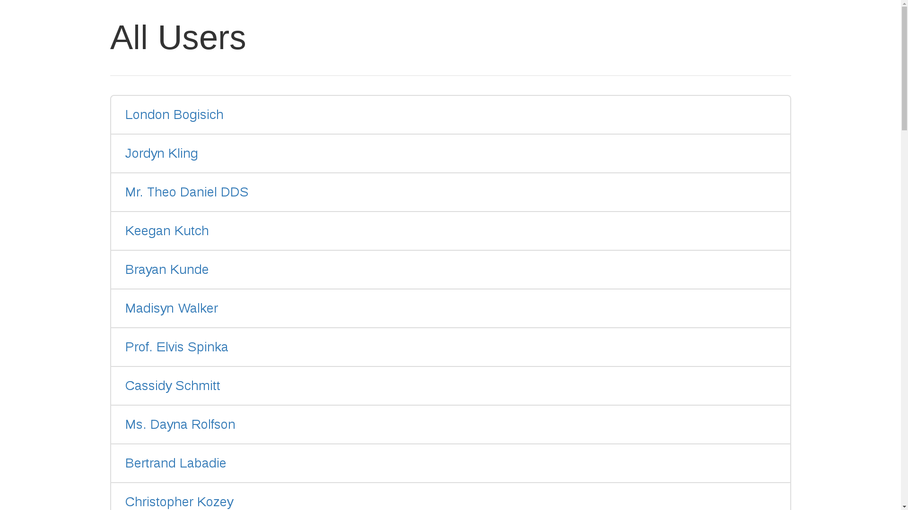

_A classic index page._

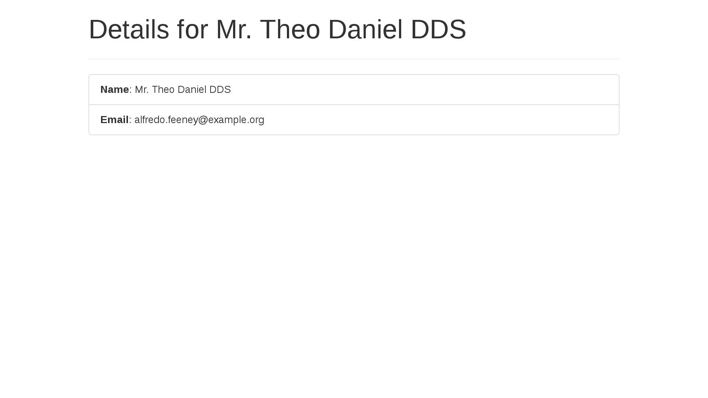

_A classic detail page._

### 5. Instructor Do: Review Activity (5 min.)

The finished files for this activity are in [2-User-Views/Solutions/Solutions](Activities/2-User-Views/Solutions). 

* In `UsersController.php`, review how you retrieve a model: `User::find($id)`.

* Explain that the `$id` in the method is the number passed to the URL.


_Annotated controller._

* Next, open `resources/users/index.blade.php`, and demonstrate how to retrieve the user's id to link to their profile page.

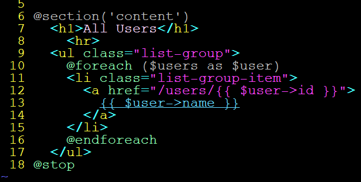

_Annotated index._

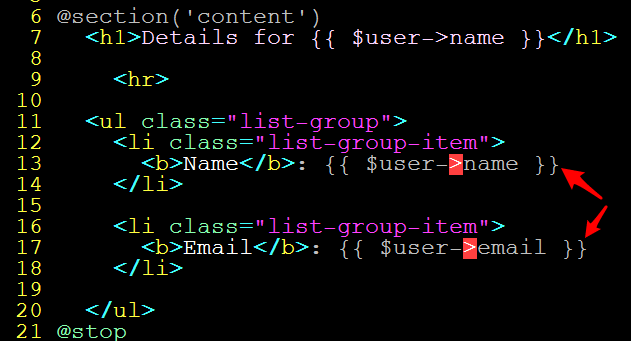

_Annotated profile._

### 6. Students Do: Update Users (20 min.)

* Explain that you update models by retrieving them, resetting their value, and saving them to the database again. 

* Remind students that you save a model by calling its `save` method.

* Slack out the following instructions to students:

  * **Instructions**:

    * In your user detail template, add a button for visitors to edit the user's information.

    * Link this button to your `edit` method, which should direct visitors to a form where they can change your user's data. 

      * To find the proper format for your button's URL, enter `php artisan route:list` in your terminal window and look for route named `users.edit`.

    * Create another blade template file. It shoud contain a form for your visitors to edit a user's information. 

      * You will need to use the `PUT` RESTful method with your form. One issue: `PUT` lacks support from HTML support. Laravel has a work around, though—include the `method_field` helper inside your form, as shown in this site: <https://laravel.com/docs/master/routing#form-method-spoofing>. 
        * Don't forget to include your `csrf_field()` helper, too.

    * In your UserController file, link your edit form to the `update` method. This method should bring in the request's name and email properties and save them to as properties for a `$user` object. Use the `save()` method on this object to update the user's info.

    * At the end of your `update` method, redirect your visitor to the user's detail page. 
      * _Hint_: <https://laravel.com/docs/5.1/responses#redirecting-controller-actions>

### 7. Instructor Do: Review Activity (10 min.)

Solutions for this activity are in [3-Update-Users/Solutions](Activities/3-Update-Users/Solutions).

* Reassure students that it's okay if they didn't finish the entire activity. 

* Explain that the `edit` method directs users to the form they use to update the model's information.

* The `update` method is where you implement the server-side logic to actually change the model's data.

* Explain the redirect call.


_The edit method._

* Explain the `withUser` syntax.

  * You can call a method called `withCLASS` on `view('template')`, and pass it an instance of CLASS. This is the same as passing `compact` with a single value.

  * You can use any class. Laravel will always figure it out.

  * Point out that you can chain `with` statements, as well.


_The common withMODEL pattern_

* Open `resources/views/edit.blade.php`. 

  * Ask students what they used for their form actions and methods.

  * Point out that your form action must be `/users/{{ $user->id }}`.

  * Explain that your form method must be `POST`, because browsers can only send `GET` and `POST` requests.

  * Explain that the `{{ method_field('PATCH') }}` function allows us to tell Laravel that we _want_ to sent a `PATCH` request, even though we're only allowed to send a `POST` request.

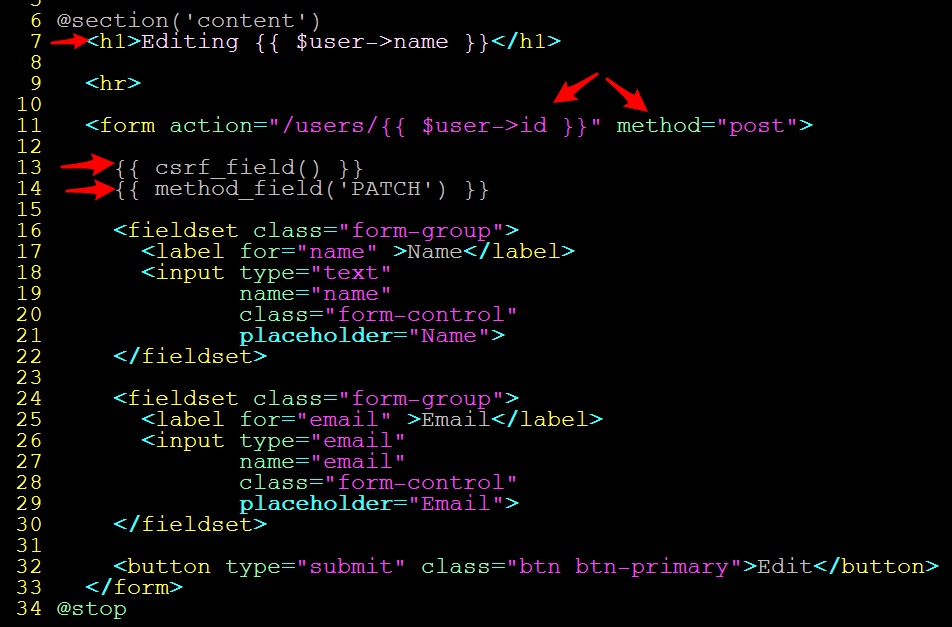

_edit.blade.php._

* This allows it to respond appropriately by calling your controller's `update` method.

  * Avoid confusing students with the difference between `PUT` and `PATCH` requests. The distinction is irrelevant. [Under the hood, Laravel treats the equivalently](https://github.com/laravel/framework/blob/be353964453ee0f750e6562419a32d387e8909f0/src/Illuminate/Routing/ResourceRegistrar.php).

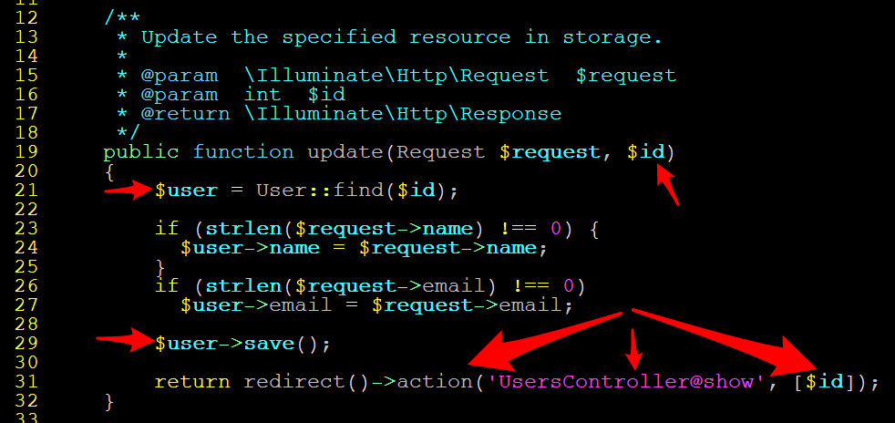

_Update method._

Slack out the solution ZIP so students have a working app on which to build the next activity.

### 8. Everyone Do: First Relationships (15 min.)

* The examples for this section are at [4-Snippets/Examples](Activities/4-Snippets/Examples).

* Point out that most sites require us to establish relationships between our data models.

  * Examples: 
    * For the user's friends: Users -> Friends. 
    * For a customer's shopping history: Customers -> Purchases. 
    * For a course's students: Class -> Students. 
    * So on and so forth.

* Laravel allows us to painlessly define these sorts of relationships.

* To demonstrate this, guide students through the process of saving Snippets: review cards that include useful code excerpts. 

* Walk through these steps with the class:

  * Scaffold a Snippets model: `php artisan make:model Snippets --migration`

  * Update the Snippets migration to include a `text` field.

  * Update the Snippets migration to include a `user_id` field. Explain thiat this allows us to associate a Snippet with a User.

  * While you're at it, add a `snippet_id` columnt to the create_users migration.

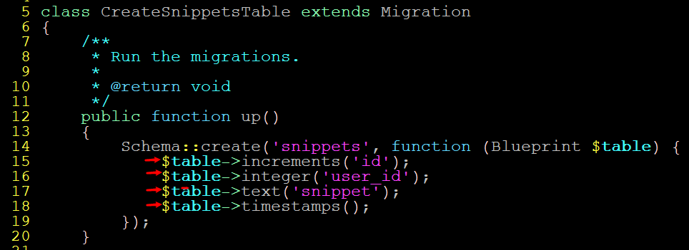

_Snippets migration._

* Refresh your migrations and seed your users again.

  * `php artisan migrate:refresh --seed`

  * We purposefully avoid updating migrations for the sake of expediency.

* Ask a student to describe the relationship between a User and a Snippet is.

* Open `app/Snippet.php`.

* Suggest that  snippet _belongs to_ a User. 

* Explain that Laravel models these relationships as _methods_ on model classes.

* Explain that the name of the method is the name of the model you want to retrieve.

* Ask a student what method we'll want to define on Snippet if we want to get its User.

* Implement a `user` method.

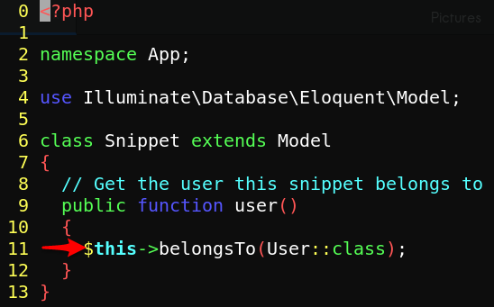

_Defining a belongsTo relationship on a Snippet._

* Explain that you define a relationship by saying:

  * `$this->relationship('Model's Class Name')`

* Explain out that `User::class` is just a way to get the string name of the User class.

* Point out that we don't need `use App\User` here. 

  * This is because we have `namespace App` on line 3.

  * This lets us refer to anything in the folder `app` directly.

* Explain that defining the relationship on the Snippet allows us to get its user, but doesn't let us get  user's snippets.

* Open up `User.php`.

  * Ask a student what we should name the method that will allow us to get a user's snippets.

  * Ask a student what the relationship between a User and a Snippet is.

  * Define a snippets method.

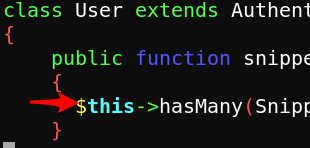

_A user hasMany snippets._

* Explain that, if a model X `hasMany` of some other model Y, then Y alwys `belongsTo` X.

### 9. Partners Do: The Snippets Feature (60 min.)

* The purpose of this activity is to give students more practice linking up MVC. It's important that students have ample time to work on this exercise, as it's very similar to their homework assignment.

* Make sure students are aware that they don't have to complete all of this exercise. You may consider slacking out each "task" one at a time, so that students don't get overwhelmed by the long instruction. 

  * Keep in mind that the most important outcome is that **all students can complete the first task**. The second task is important, but to a lesser degree. The bonus is just that—extra.

* Slack out the following instructions to students:

  * **Instructions**:

    * **First Task**: Save snippets, and associate them with users.

    * Keep in mind you'll be creating snippets _only_ in association with Users.

    * Read Laravel's documentation on nested resource routes: <https://laravel.com/docs/5.1/controllers#restful-nested-resources>

    * Create and register a controller for your Snippets resource.

    * Open your user detail template.

    * Add a form that allows a user to save a code snippet.

    * In the relevant controller method, create and save a new snippet.

      * Be sure you can access the Snippet and User classes in your controller.

      * Note that your form action contains the user's ID. This allows Laravel to automatically provide you with the user in your `store` method. Changing its signature to the following allows you to access the user directly:

      * `store(Request $request, User $users`

      * It's crucial that you use the name `$users` for this kind of automatic resolution. Docs: <https://laravel.com/docs/5.2/routing#route-model-binding>

    * Create a new snippet.

    * Save the snippet to your user's list of snippets.

      * You have access to these snippets through the relation you defined on the model. How do you think you save a new snippet to it?

    * Redirect to the user detail page.


```
* **Second Task**: Retrieve user's snippets, and display them.

* If the redirection works, your snippet probably saved . . . But it would be better to display it to make sure.

* Display a message if the user has no snippets.

* Otherwise, update your user detail template to display all a user's snippets.

  * Wrap this in `<pre>` tags if you want it to look good.

  * Before you update your controller&mdash;do you have to?


* **Bonus Tasks**

* That list of snippets looks pretty slick. But it would be better with a title.

* Create a migration that adds a title column to the Snippet table. Make sure it's nullable.

* Add a button that allows users to delete snippets.

* Actually delete the snippets.

  * *Hint*: This isn't as easy s it sounds. Experiment, and discuss with your partner.
```

### 10. Instructor Do: Review Activity (10 min.)

The solutions to this activity are in [4-Snippets/Solutions](Activities/4-Snippets/Solutions).

* This is a substantial activity, so focus on the "big picture".

* Review using a nested resource controller.

  * Explain that, by convention, this would be named `UserSnippetsController`.

  * Explain that we use dot notation in `routes.php` to indicate nested routes.


_Dot notation to implement nested routes._

* Open `UserSnippetsController.php`, and explain `store`.

  * Point out that Laravel thinks of our URLS as taking the form:

    * `/users/{users}/snippets/{snippets}` ... Where the brackets indicate an ID. 

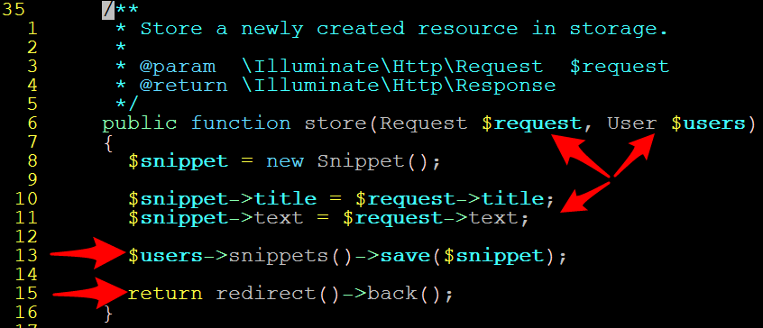

_route/model binding in UserSnippetsController._

* When we `POST` to the `store` method of `UserSnippetsController`, we have the user id from the URL (`{users}`).

* By passing `User $users` to `store`, we tell Laravel that we want it to find the User whose ID is the value of {users}. For this to work, we have to name the varible `$users`, to match Laravel's default URL forms.

* Spend the remainder of the block answering student questions.

* Slack out the solution ZIP and encourage students to review it.

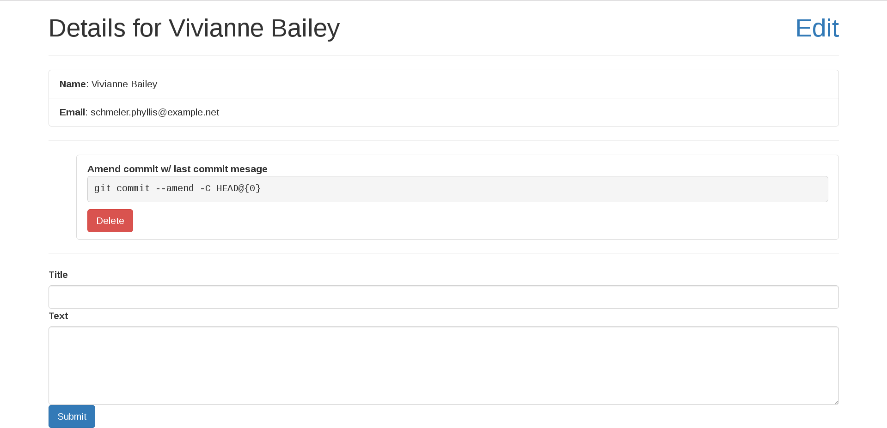

_The completed snippets page, with mocked-up delete buttons._

### Copyright

- - -

Coding Boot Camp © 2016. All Rights Reserved.
