## 21.1 Lesson Plan - Mobile Mayhem with React Native

### Overview

In this lecture, you'll introduce the class to React Native. This JavaScript framework allows devs to build mobile applications using a syntax similar to ordinary React. Some students may choose to focus on review instead – we’ll provide you with alternative activities to suit their needs. 

##### Instructor Priorities

* Students should understand how React Native works at a high-level. 

* Students should have a basic command of its systems for displaying elements and relaying data. 

* Students who opt to learn React Native should **ABSOLUTELY** install the framework's library on their machines before coming to class.

##### Instructor Notes

* If your students come to class without setting up React Native, they'll be spending nearly half the class just running through basic instructions. Tell them to spend an hour at home setting the framework up; there will be no time for it during the lecture.

  * Here are the guides, by the way:
    * [Windows](Supplemental/React-Native-Basic-Guide-Win.pdf)
    * [MacOS](Supplemental/React-Native-Basic-Guide-Mac.pdf)

* You should also have React Native installed on your machine. Make sure you check out the solution to each activity in this unit, too; you'll be typing some of them out when you go over the exercises in class.

* React Native isn't for everyone!

  * The setup is challenging. 
  * Windows users can expect many bugs. 
  * Machines lacking in CPU and GPU power will trudge through long code compilations and slow performance. 
  * Some students will struggle to complete even the most basic apps, especially if they haven't yet nailed down the React full-stack model (states and props, the component lifecycle, etc.). 

* Still, let's look past these red flags. Students willing to take these risks and troubleshoot through issues will adapt to React's demands. They'll be rewarded with basic competency in one of the most robust, dynamic frameworks available today.
  * Do NOT pressure all your students to pursue React Native. You'll better serve your class by letting them decide whether they should learn this new framework or if they should build on skills they're more likely to encounter on the job.
    * DO pressure your top students to learn the framework, though. Knowledge of this tech will stand out on a resume and in their GitHub profiles.

* As an instructor, begin class by offering students to "choose" their own path for the week. They can either 

  * Dive into React Native -- knowing that the technology is in beta and that their experience may require significant troubleshooting.

  * Opt to focus on reviewing a key activity from a past class (ex: Node, Express, SQL integration in the Hot Restaurant Application).

  * Opt to focus on interview prep and coding drills. 

  * **Instructors/TAs**: You should divvy yourselves up across each of these options. One instructor or TA should help facilitate each group. 

* Notice how we do not have a traditional homework assignment for this unit. Tell your students that they can submit any work they've completed outside of class this week. 
  * Your React Native students should submit anything they'd like to build. They need only hand in a mobile app that meets their current skill level in the framework. 
  * Have students in the review groups submit anything apropos of their lectures.

- - -

### Class Objectives

* To offer your class some initial exposure to React Native.
* To support your students if they start to lag behind some of the concepts.
* To offer students who opt out of React Native to review a previous exercise or work on coding interview drills.

- - -

## Important Notes on Outdated Exercises

* The exercises in this lecture run off of React Native 0.37. Problem is, Facebook is still developing this library and releases a new version every two weeks. It's possible these exercises may stop functioning like expected.

* To combat this, you're going to initialize your React Native exercises with this node package: [`rninit`](https://www.npmjs.com/package/rninit). This lets us run React Native with the version of our choice. 

* You'll find instructions for this in Step 3.

## Important Notes on Running These Exercises

* You'll notice that the skeleton and solution directories in each activity contain two index files: `index.android.js` and `index.ios.js`. To run these applications, you'll need to initialize new project directories with names that match the `registerComponent` function at the bottom of the index files. When the new directory is made, replace the template index files with the ones in Skeleton/Solution.

  * Say you see this at the bottom of the exercise file:
       

    * You would take the flex1 name and create a new react-native project, like this: `rninit init flex1 --source react-native@0.37.0`.

    * When your terminal/bash command finishes creating the directory, replace the newly made index files with those in the Skeleton/Solution directories.

    * The first argument is the name of your project, the second argument is the name of the root component you want to render.

## Important Notes on a Common React Error

* When you or your students run your React Native files, this error may pop up in your mobile device emulator:
    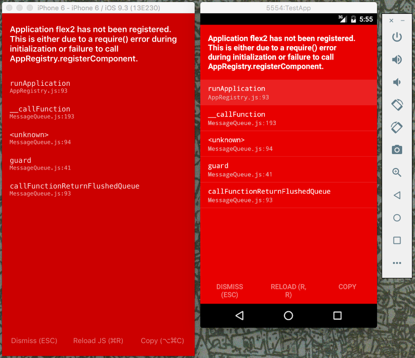

* If so, you need to close the window that React Native generates whenever you run your apps.

    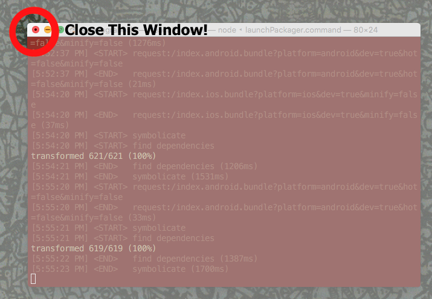

* The error shouldn't pop up the next time you run the app again.

* Make sure to let students know about this solution if any of them run into this error.

### 0. Instructor Do: Welcome Class (1 min)

* Greet your class, say your usual hellos and answer any questions students may have before the lecture starts.

### 1. Instructor Do: Intro (15 mins)

* Before breaking up into groups, give the class a rundown of React Native:

  * React Native spins the Virtual DOM concept for mobile applications. 
    Ask a student to explain Virtual DOM to you. Recall how React creates a simulated version of the Document Object Model--everything rendered in a web browser.
    * React uses the Virtual DOM as an intermediary between the browser and the code you write. 

  * Show them [this image](https://cdn.infoq.com/statics_s2_20160622-0236/resource/articles/react-native-introduction/en/resources/21.jpg), then give them the following explanation:

    * Because of this intermediary nature, we can also use React to render applications for iPhones, iPads, Android devices and even (in theory) virtual-reality systems like Microsoft HoloLens.

  * Despite the similarities, React Native doesn't let you copy and paste your Web code into a program that will somehow spit out a mobile app. There are no `
` and `<h1>` tags in mobile application development. 

  * But just like JSX in vanilla React, developers can create components to render a GUI and handle data at the same time. The React Native CLI lets us compile these components into code that our iOS and Android devices can execute.

  * Here's the key takeaway: React Native empowers developers to re-use the "logic" of our web applications (things like HTTP and API requests). It also gives us a way to create Android or iOS applications using a JSX in a syntax similar to the one we've studied.

### 2. Instructor Do: Divide the Class (3 mins)

* At this point, remind students that if they don't want to learn React Native, they should choose one of the other two study groups: reviewing interview techniques or revisiting key activities.

* Have at least one TA to lead each of refresher groups; they should take their students into separate spaces, lest three lectures take place in the same room.
  * Tell students that they must opt for one of these review lectures that if they haven't installed React-Native.
  * Before moving on to the next step, make sure that only the React Native students are in your classroom.

### 3. Students Do: Get Used to React Native (5 mins)

* Warn students again that React Native is in beta -- and it is rapidly being developed by community developers. Facebook updates the library every two weeks--the exercises we made before might that might not run properly in the latest version of React Native.

* To tackle that problem, students should install `rninit` on their machines:

  * `npm install -g rninit`
  * This will let us designate the proper version of the framework and prevent any bugs from popping up in our exercise.

* In order to warm the class up, have them initialize a project in the React Native framework. Remember, they should use rninit for this.

  * Tell them to run this command in particular: `rninit init testProject --source react-native@0.37.0`
  * Note the source flag and its argument at the end of the command. This lets us initialize a project with React Native 0.37.0. You and your students will need to initialize your projects in a similar fashion.

* After they initialize their projects, tell your students to edit the placeholder text in their dummy templates. They should send the Slack channel screenshots of their modified app.
  * Remember, Windows students should edit their `index.android.js` file, while Mac users will modify `index.ios.js`.
  * Remind your class that they can refresh their apps without re-running `react-native` on the command line.
    * iOS: <kbd>⌘</kbd> + <kbd>R</kbd>
    * Android: double-tap <kbd>R</kbd> 

### 4. Instructor Do: Styling Objects (5 mins)

* Direct your class's attention to the `StyleSheet` at the bottom of the template file. Point out how mobile apps have no concept of "CSS" or pre-defined definitions like `<h1>` or `<h2>`. 

* Instead, we must write out style objects in the `StyleSheet`, React Native's so-called "style reference" feature.

    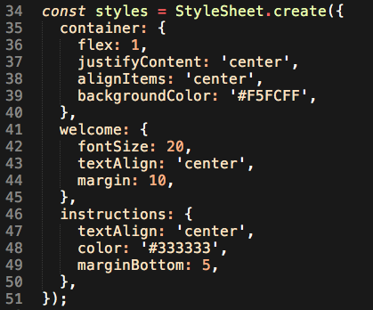

* Each CSS object can alter the look of the app's JSX components--the dev just needs to specify the component's `style` prop.

    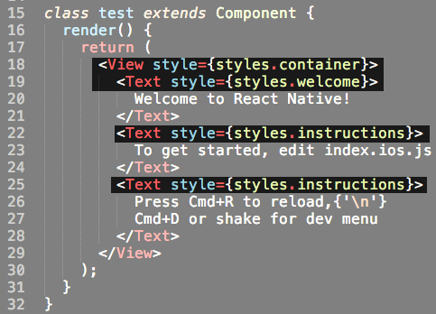

* Send students to the following link: <https://facebook.github.io/react-native/docs/style.html>. Tell them to experiment with the style objects in their template's StyleSheet.
  * You should also point out that:
    * hyphenated CSS style properties get the camelCase treatment. For instance, `line-height` becomes `lineHeight`.
    * CSS properties with `px` values instead take integers in React Native. **Nix the px**. 

### 5. Everyone Do: Style and Flex Exercise (15 mins)

* Slack out the [first activity](Activities/1-flex1/Skeleton). 

* Tell your students to note how the folder contains only two files: `index.android.js` and `index.ios.js`. 

  * Explain that for each activity, they must initialize a new React Native project that shares the name of the component being exported via the `registerComponent` function.
  * For instance, this first activity must be initialized with `rninit init flex1 --source react-native@0.37.0`.
  * For more information, see "Important Note on Running These Exercises" at the top of this lesson plan.

* You're going to walk your students through this exercise. Everyone should be working in their index file of choice while following along with your edits.

* First, advise students that we have style objects waiting to be coded, but to ignore that for now. Instead, add the proper values to the blank style props in each component.

  * For instance, the first component should carry a style prop like this: `style={styles.container}`.
  * Type the values into each blank style prop according to either of the [solution files](Activities/1-flex1/Solution). 

* Now pose this question: how can we make sure that style remains consistent no matter the resolution of the device's screen? 

  * If we designate a specific pixel value for height and width, then elements will take up different portions of each screen.

* Instead, we can use the `flex` property. Tell students that once a container element receives a flex value, then all of the elements inside can be sized proportionally based on the number of flex values passed to each child element. 

  * That's a complex concept to grasp on abstraction alone, so offer this example. If a flexed container holds two flexed children, and those children each have flex values of '1', then those children will each take up half of the container. 

      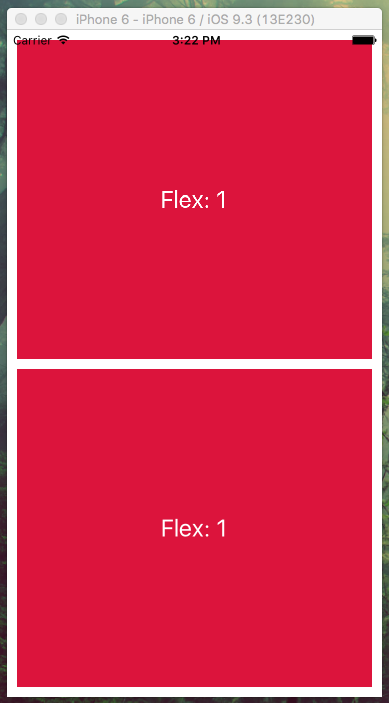

    * But if one child has a flex value of '2' while the other has '1', then the first element will take up two-thirds of the screen, leaving the other third for its sibling.

      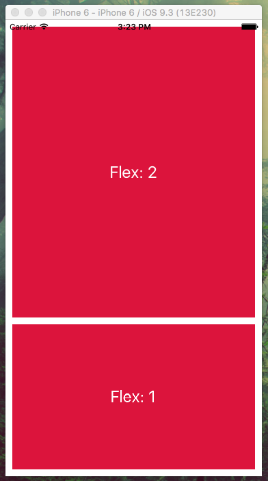

    * **In your app, add the unfilled flex values to the `StyleSheet`.** 

* If you run the app now, you should see a red screen with three lines of text. Why? We haven't designated margins yet. Explain that you can add margins and padding with pixel values while still using flex for the content.

* Add in the margin values just as they were in the solution. When finished, your app should look like this:

    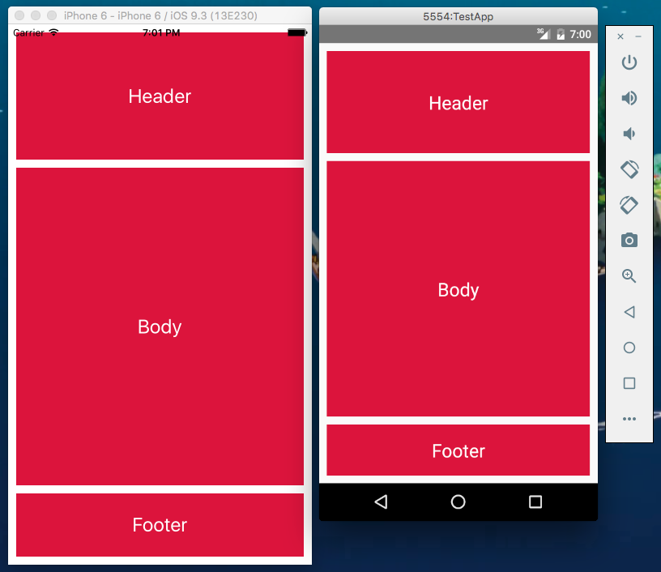

* Give students about three minutes to play around with the flex values. Answer any questions students might have about this concept.

### 6. Students Do: Flex2 Exercise (20 mins)

* Tell students that with Flex, components will appear from top to bottom by default.

* But what if we want to arrange elements from left to right? Tell students that they can add `flexDirection: 'row'` in to a container's style object; this will arrange child elements in a row rather than a column (the default direction). 

  * Your students need to know this for the next exercise.

* Slack out [flex2](Activities/flex2/Skeleton). Tell students to follow the instructions typed in the beggining of their index file of choice. Their finished app should look like this:

    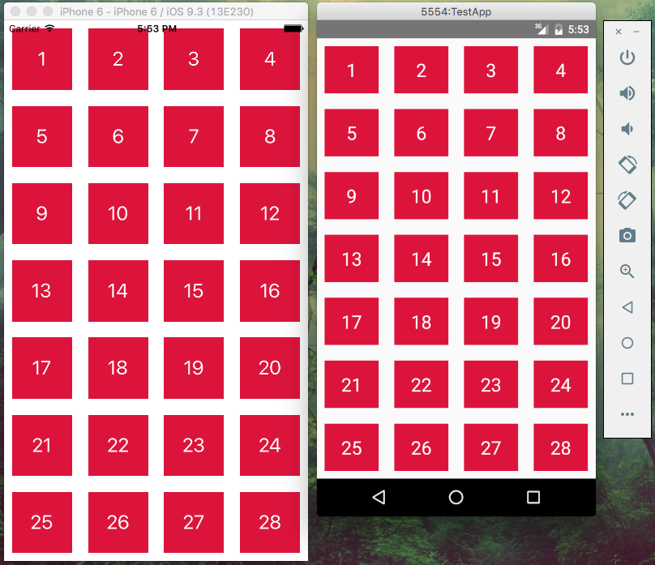

* **TIP**: If any students get stuck when trying to type out the JSX, tell them to focus on nesting `Text` tags in `View` tags. 

### 7. Instructor Do: Go over Flex2 (5 mins)

* Tell students to stop coding and ask them to raise their hands if they were able to finish. If you only see one or two hands, give the class an extra five minutes to attempt solving the activity.

* When time is up, open one of the [solution files](Activities/flex2/Solution) on your computer. Point out how you created seven instances of nested `View` components, each with four `View` components containing `Text` tags for each number.

    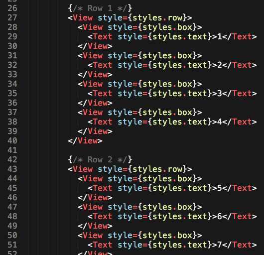

* Show how you add the `flexDirection: row` to each child component in `Views` with the `row` style. Explain that while the rows themselves are orientated in columns, that their child components follow a row orientation.

    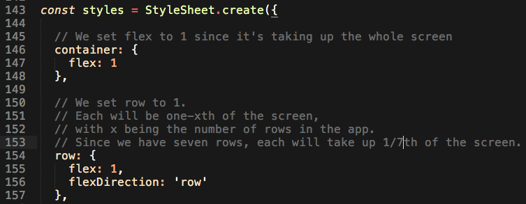

* Why does each each element have a flex value of '1'? Notice how every single element takes up an equal proportion of the screen. There's no need to specify different flex values for each component since all like elements take up the same real estate.
  * Every row is the same size.
  * Every block in each row is also the same size.

### 8. Students Do: Touchable Opacity and React Native Imports (15 mins)

* Direct your students to the top of their index file of choice, specifically the imports from `react-native`.

    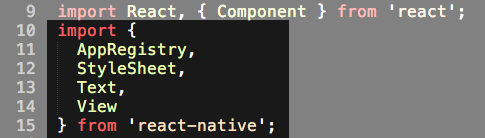

* Explain how this acts similar to `require` in Node. Each component gets imported from react-native, but there's more than just the four displayed here. To use the others, we need to import them.

* So what are these other components? Send students to the [React Native Documentation site](https://facebook.github.io/react-native/docs/getting-started.html). Tell them that to import any of the components listed in the left sidebar, they just need to add a line in the `react-native` import that matches the name of the component.

* Now Slack out the [touchables](Activities/3-touchables/Skeleton) activity. 

* Tell your students that they'll be editing the solution to the last assignment so that each box changes opacity whenever the user clicks it. Which component will they need? They'll have to either find it in the documentation or find it through a Google Search. 
  * **Give them this hint**, though: the component they need functions in almost the same manner as a View, but has a baked-in behavior to  fade whenever the user touches it
    * The answer is TouchableOpacity. Tell them this about 5 minutes into the exercise, just to make sure everyone is on the right track. Regardless, it's wise to get your students primed for searching the React Native documentation for the components they'll need.

### 9. Instructor Do: Go over TouchableOpacity (5 mins)

* Open the one of the index files in the [skeleton](Activities/3-touchables/Skeleton). Go through the file with your class until it matches the [solution](Activities/3-touchables/Solution). 

* Namely:
* Import the `TouchableOpacity` component in the `react-native` import at the top of the screen.
* Find each `View` component that has a `box` style and replace it with a `TouchableOpacity` component.
* Run the file, and note the transparency effect when you click on any of the boxes. Remind students that you didn't need to change any rules in the `StyleSheet`--the effect lies within the new component.

### 10. Break (15 mins)

### 11. Instructor Do: Introduce the ScrollView Activity (5 mins)

* Tell the class that they'll have two new imports to work with for the next activity: the ScrollView component and the Dimensions API.

  * Dimensions works as an alternative to flex--it grabs the actual dimensions of the user's device (or the app window if the user is running a multi-window view). This means that we can divide the app's height and width in our stylesheet to designate proportional segments of our screen.

  * ScrollView acts like a typical view element, except that it lets us scroll through large sections of content. In other words, we can place a ton of text, views and images that exceed ScrollView's designated height, and then let the user drag their finger to scroll through the content. 
  * Ask them to think of any news app they might have used. Most feature a sticky header and footer while letting users scroll through each article. 
    * ScrollView makes this functionality a breeze, as they'll soon discover. 

### 12. Students Do: ScrollView and Dimensions (15 mins)

* Slack out the [scrollView activity](Activities/4-scrollView/Skeleton). 

* Tell students that they will need to nest the `Text` components within a ScrollView component. That ScrollView component will, in turn, must be nested in a View component. 

  * This requirement is laid out in their skeleton file, as well.

* Then, they'll have to add in the proper margins and height values to the component with the StyleSheet, just like in the other style objects.

  * **NOTE**: each of the style objects incorporates a variable that relies on the Dimensions API.

* In the end, they should end up with an app that displays an article...

    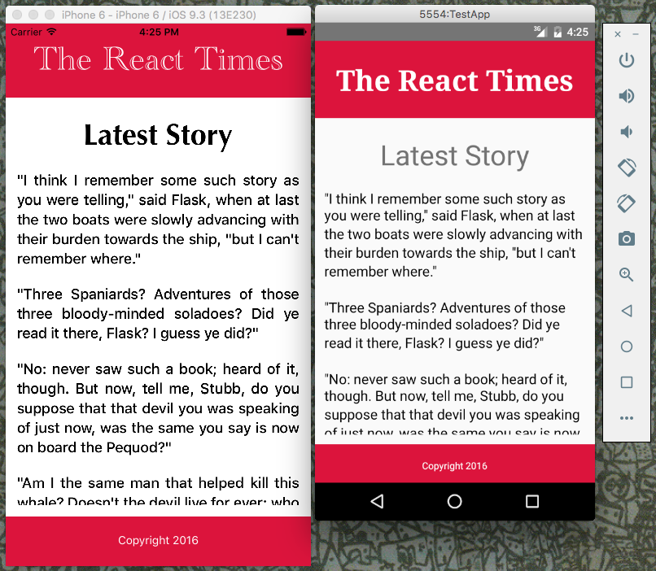

* ...that users can scroll through!

    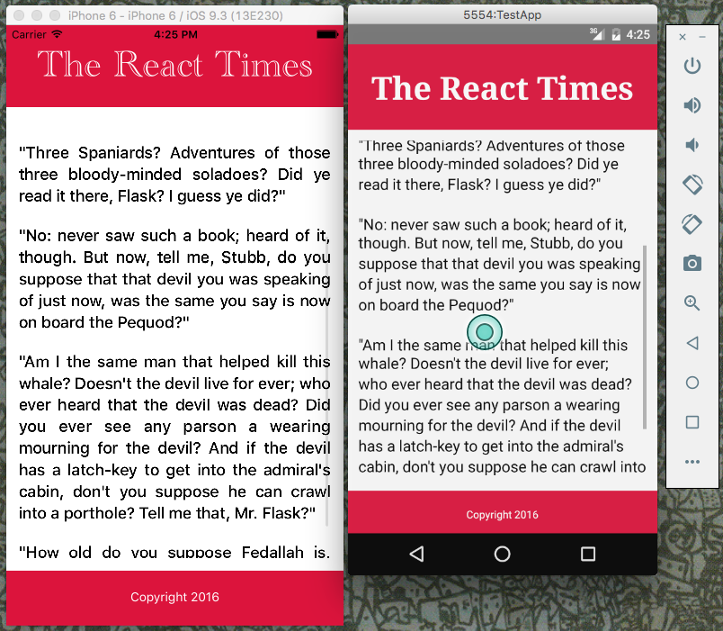

### 13. Instructor Do: Go Over Scrollview (5 mins)

* Open the [skeleton](Activities/4-scrollView/Skeleton) file on your computer and edit it to match with the [solution](Activities/4-scrollView/Solution) file. 
  * Be sure to point out that students may need to set their height and margins to different values between their Android and iOS index files, due to the way React Native handles component sizes between mobile operating systems.

### 14. Students Do: Setting State with a Form (40 mins)

* Remind students about React's state system, and how developers create components that alter the data within their child components.

* To that end, we're going to create a React Native app that can change state based on form input. Slack out the [form activity](Activities/5-form/Skeleton). 

* Students will complete the file by adding `TextInput`, TouchableOpacity and `View` components in the designated spots. They'll also need to fill out some empty functions to give right components the ability to change the app's state. 

  * We've provided directions for each step of this process.

* Run the finished app to show students what they'll be creating.

  * By the time your students finish, they should have an app that looks like this.

    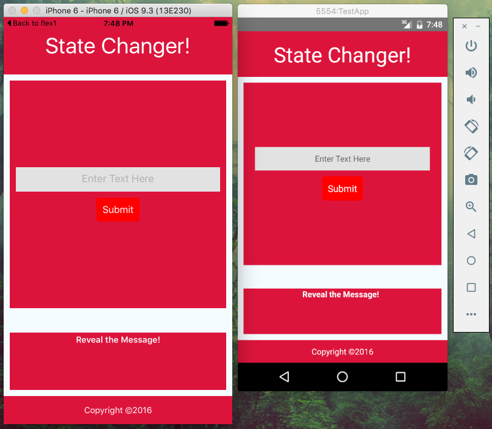

  * And when the press the link to reveal the message, they'll see whatever they entered into the textbox.

    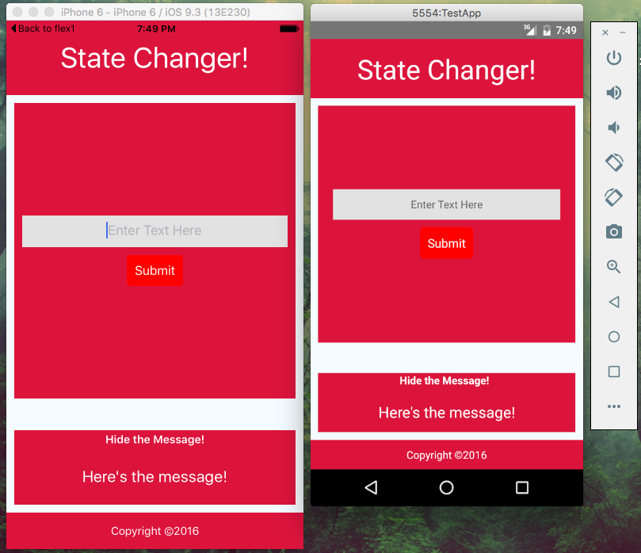

* If students encounter any problems setting up the `TextInput` component, send them to the [relevant page in the React Native docs](http://facebook.github.io/react-native/releases/0.37/docs/handling-text-input.html). 

  * If they still have an issue, feel free to walk them through the component's makeup one-on-one, consulting one of your [solution files](Activities/5-form/Solution). 
    * Altering state with TextInput is a pretty tough concept to nail down, so it's okay to offer this level of support.

* If you only have 30 minutes left in class before this assignment starts, feel free to slack out the completed `setMessage` and `toggleDisplay` functions from one of your [solution files](Activities/5-form/Solution) file. 

### 15. Instructor Do: Go over the Form Exercise, and Wrap-Up (10 mins)

* Open one of the [solution files](Activities/5-form/Solution) on your computer and direct students to the two functions above the component's render method: `setMessage` and `toggleDisplay`. Explain how each works based on the comments provided in the App.

    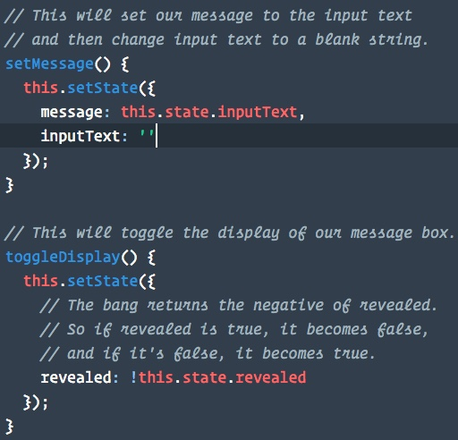

* Scroll down to the `TextInput` component in the render method. Note how the `Value` prop of the component recieves the `inputText` state, which changes based on the function passed to the `onTextChange` property. Basically, whenever the user types into the input box, they change the `inputText` state, which in turn changes the value displayed in the input box (more specifically, the `Value` prop).

    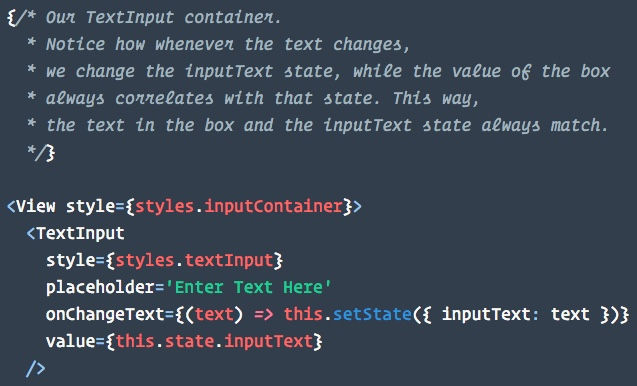

* Scroll down to the `TouchableOpacity` component with the `revealer` style object. Note how it's connected to the `displayToggle` button.

    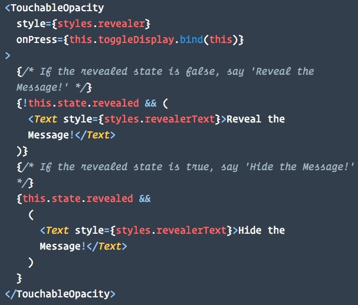

  * Also note the `&&` conditional, which operates the same way as in vanilla React. In this case, we display one piece of text while the message stays hidden, and display the other when the it gets revealed.

* Ask the class if they have any questions about these concepts or anything else you taught in class today. If not, dismiss the class.

- - -

### Copyright

Coding Boot Camp (C) 2016. All Rights Reserved.
