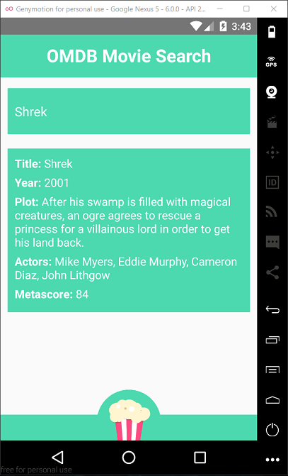
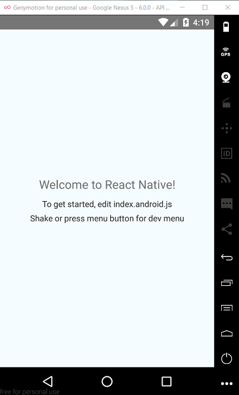
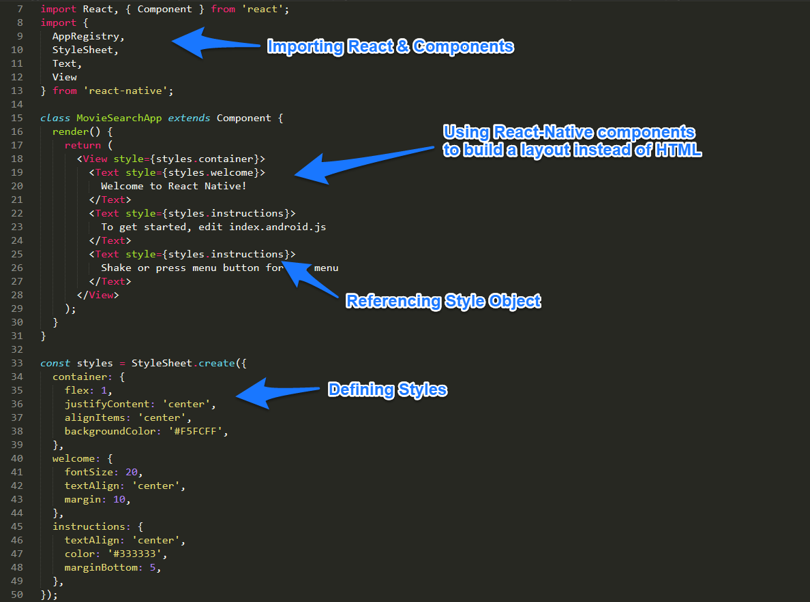
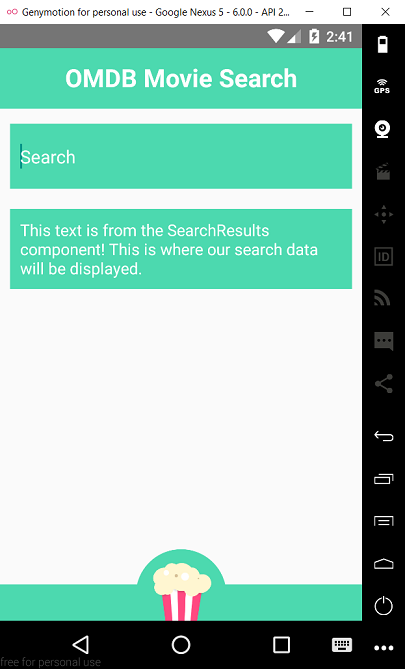
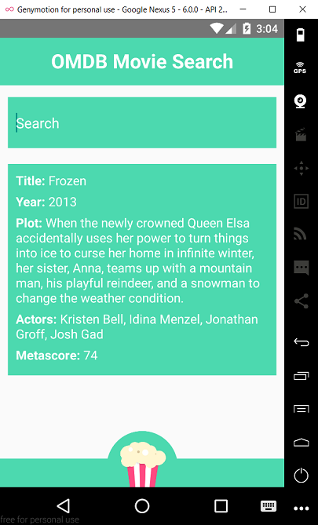
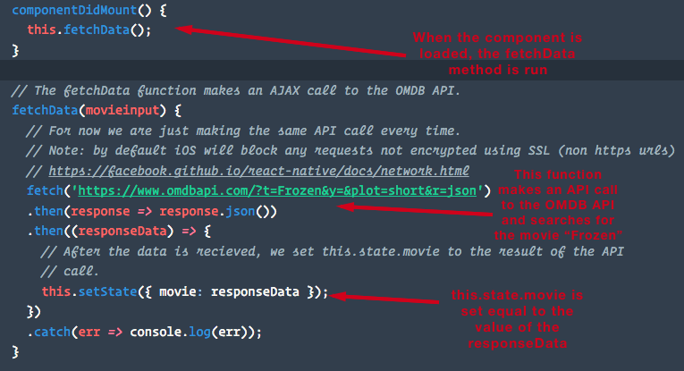
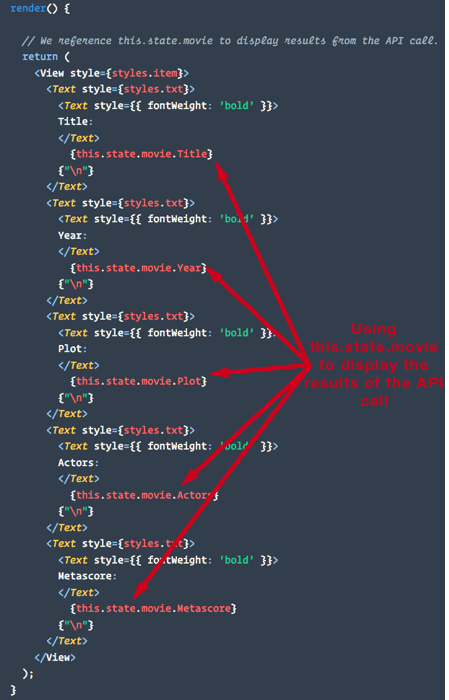
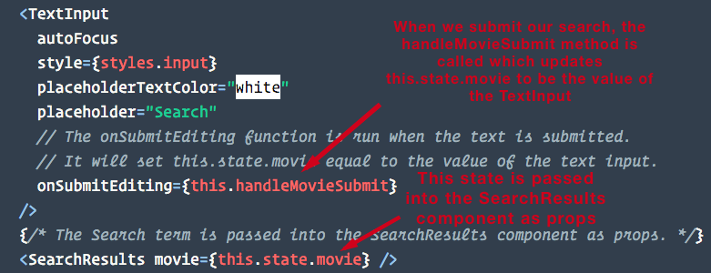
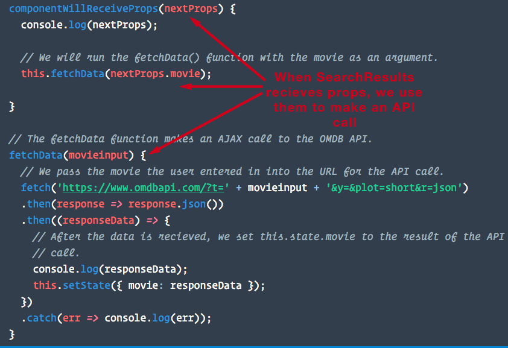

## 21.2 Lesson Plan - React Native: The Movie (app)

### Overview

In this class, we'll review the React Native principles from 21.1 by creating an mobile app for movie data. This time, we'll build an app that relies on multiple component files, as well as data from an outside source -- the OMDB api. Once again, students will have a choice of working with React Native or participating in a review lecture; those refreshers will focus either on interview questions or a past activity.

##### Instructor Priorities

* Make sure all students can set up a basic React-Native app with multiple component files and API calls.

* Reinforce the React fundamentals: props, states, component lifecycles, etc.

##### Instructor Notes

* **IMPORTANT**: Before class begins, you should initialize a React Native project on your computer with a name the matches the app's -- `MovieSearchApp` in this case. You'll start the class by showing students the solution in action, so best prepare for that now. If you're on windows, make sure you've opened your Android Virtual Device (AVD).

  * Like in the last lecture, use `rninit` to create your directory -- not `react-native`. 
    * This activity was completed with React Native 0.37.0, and it's possible that a newer version of the framework will deprecate important features in our exercise. Using `rninit` will circumvent this.
  * Run this in terminal/bash: 
    * `rninit init MovieSearchApp --source react-native@0.37.0`
  * Then open [Step 3 of the activity](Activities/1-MovieSearchApp/Step1). Copy into your project directory the index file matching your device emulator (`index.android.js` or `index.ios.js`).
  * Run your project to make sure it works: `react-native run-android` or `react-native run-ios`.

* We'll be using the [OMDB API](http://www.omdbapi.com/) to power our mobile app. That said, the `fetch` function will work with other REST APIs, or any database with GET and POST routes.

* React Native involves a different coding paradigm than most of our students have encountered--some will no doubt run into technical problems. Make sure you let students know to raise their hand at any point if they get stumped.

  * On that note, only students who took the last React Native lecture should  create the movie app. Anyone just jumping into this will likely find themselves at a loss. The only exception would be your star students, and even then they'll have a tough lecture if they haven't yet worked with this framework.

* Some of the steps in the main activity might take a few minutes to load (starting up Android emulators, initializing new project folders, and so on). Be prepared to help students and to talk about high-level React concepts during any pauses!

* **You will have extra time available during this lecture**, and that's by design. You can extend either Part 1 or Part 10 by 20 mins if your students would benefit from the extra time. If you don't use either of these extensions, then give the class that time to get started on their homework. 

### Class Objectives

### 0. Instructor Do: Welcome Class (5 mins)

* Say your hellos and answer any questions students may have about the last lecture.
  * There's bound to be a few more than usual--the last lecture covered some pretty challenging material.
* Split the class in three groups: Review of Old Activities, Interview Prep and React Native. You'll teach the React Native group while your TAs will supervise the others. 
  * Make sure each section gets their own room -- you don't want three lectures happening in the same place.

### 1. Instructor Talk: Class Introduction (5 mins or 25 mins, depending)

* Before you begin, ask the class if they'd like to go over either the scrollView or form activity from the last lecture. 

  * If less than a fourth wants help, talk with them 1:1 sometime after class to go over any concepts they're struggling to grasp.
  * If at least a fourth of your class says yes, spend a total of 20 minutes going over either [scrollView](../21.1/Activities/4-scrollView/solution), [form](../21.1/Activities/5-form/solution), or both. 
    * Don't worry about time! The extra 20 minutes has been allotted for you.
    * Don't just run through the activities--ask the class the specific parts of the solution they're struggling to understand. Go over each of their inquiries.

* Whenever you're ready, tell the class you'll be walking them through the development of a simple React Native app that lets users search for information about movies. Add in that building the app will also serve as a review the major concepts of the last lecture's concepts.

* Open the final version of the app and demonstrate its functionality.

  * Go to the project folder you made.
  * Make sure you have your android emulator running.
  * Type `react-native run-android` or `react-native run-ios` and run it.

      

### 2. Everyone Do: Create a React-Native Starter-App (5 mins)

* Tell your class that they'll need to set up their project directories. Instruct students to cd their way to whichever folder they'd like to store their new project in. 

* Your students should run the following command: `rninit init MovieSearchApp --source react-native@0.37.0`.

* While `rninit` sets the project up, make sure your Windows students have started their AVDs. 

* When `rninit` finishes, your students should navigate to their new app directories and run `react-native run-android` or `react-native run-ios` to boot their template apps.

    

### 3. Everyone Do: Look at the Code (10 mins)

* Instruct students to open `index.android.js` or `index.ios.js` in their project folders and have them look through the code. 

* Ask them to note some of the features in the template that we went over in the last app. Make sure you go over the following.

  * The imported components from React Native.
  * The absence of HTML tags in favor of React-Native's unique components like `<View>` and `<Text>`. 
  * The StyleSheet, React Native's style reference for all components that compose the GUI.

    

* Have students take a look at [React-Native's Core Components](https://facebook.github.io/react-native/docs/tutorial-core-components.html) and then experiment with dropping them into their code. Remember, you have to import new components if you want to use them!

### 4. Instructor Do: Movie App Step 1 (5 mins)

* Open the folder with the pre-built app, then copy and paste all three files from the [Step 1 folder](Activities/1-MovieSearchApp/Step1) into your project's main directory. Then start the app (`react-native run-android` or `react-native run-ios`).

    

* Take a look at the code with your students. Ask them to point out what's changed since our starter app.

  * In this step, we've added styling, a `<TextInput>` component, an `<Image>` component, and the `<SearchResults>` component. Ask the class if they know the significance of that last addition.
    * Answer: React Native has no “SearchResults” import out of the box -- we created this component ourselves.
    * Open the `SearchResults.js` file. Note how new components are imported and exported -- you can demonstrate this with the export command at the bottom of `SearchResults.js` and the import command top of your chosen index file.

* **Note**: At the moment the `<TextInput>` component isn't connected to anything and the `<SearchResults>` component will only display static text.

### 5. Students Do: Movie App Step 1 (30 mins)

* Have students try their hand at adding the `<TextInput>`, `<Image>` and `<SearchResults>` components. Slack out [Step 1's `SearchResults.js`](Activities/1-MovieSearchApp/Step1/SearchResults.js) and task students with creating an app that matches the one you just showcased.
  * Slack out the [popcorn.png file](Activities/1-MovieSearchApp/Step1/popcorn.png), too. They'll need that for the footer.
  * Don't send out those index files, though! Your students should consider how to create an app that matches the layout on your screen.

### 6. Instructor Do: Movie App Step 2 (10 mins)

* Copy and paste the files from [Step 2](Activities/1-MovieSearchApp/Step2) into your project directory. Afterwards, restart the app.

* Once again, go over the new code with your class and ask them to point out the additions since the last step. 

* The big takeaway? We've finally added API functionality to our app!
      

* Our app triggers an API call to OMDB whenever the `SearchResults` component renders. It will search for Disney's Frozen whenever the app launches.

  * We're using `fetch` to make our API call. Have students read through the official [fetch documentation](https://facebook.github.io/react-native/docs/network.html) for about two minutes.

    * When times up, ask someone for a summary.
    * Something akin to this should work:

      * "Fetch accepts a URL and returns GET and POST data straight into to our component."

    * Direct students to the `SearchResults.js` file. Note how after the API call finishes, we set `this.state.movie` to the resulting object of data.

      

    * We then display the data by referencing specific parts such as `this.state.movie.Title`.

      

* **Note**: Yes, we are making an API call. But the search box is still disconnected from our fetched data.

### 7. Students Do: Movie App Step 2 (30 mins)

* Now it's the students' turn. Have them use `fetch` to make a call to the OMDB API on load and display some of the data. They should be editing the `SearchResults.js` file you sent them earlier.

* For reference, the OMDB API can be found [here](http://www.omdbapi.com/).

* One again, here's the [fetch documentation](https://facebook.github.io/react-native/docs/network.html).

* Remind them that they're not connecting the form with `SearchResults.js` just yet. For now, the app should request OMDB data with a hard-coded term of their choice.

### 8. BREAK (15 mins)

### 9. Instructor Do: Movie App Step 3 (5 mins)

* Copy and paste the files from [Step 3](Activities/1-MovieSearchApp/Step3) and restart the app. This is the fully functioning app that we showed off at the start of class.

    

* Go through the code and ask the class if they can spot any differences between the current app and the one in the last step. Not the following:

  * On submit of the `TextInput`, we set `this.state.movie` of the parent component to the submitted value.

  * That value is then passed into the `SearchResults` component as a prop.

    

* When the `SearchResults` component recieves new props, it uses them to run the API call. We accomplish this with the `componentWillRecieveProps` lifecycle method, much like in vanilla React.

    

### 10. Students Do: Movie App Step 3 (35 or 55 mins, depending)

* Have the students try connecting the API call in `SearchResults` with the search form in their index file. 

  * Don't slack out any files. They should work on this step with their current code.

* If they get frustrated tell them not to worry. This is difficult material--if they don't understand the concepts yet, it will click with enough practice!

* Consider extending this activity by 20 minutes if you feel your class would benefit from the additional time.
  * **NOTE**: Only add the time if you didn't extend Part 1.
  * If you're concerned about which class extension should take priority, it's Part 1. The review of 21.1's concepts will prove more foundation--without a grasping that material, students will find 21.2 confusing. 

### 11. Wrap Up and Regroup (5 mins)

* Slack out the code to students and go over the following key concepts from the exercise.

  * `Fetch` and API data.
  * Changing state with `TextInput`.
  * Changing state with `fetch`.
  * Sending data between two different component files (i.e., props and the componentWillRecieveProps lifecycle method).

* Answer any other questions that they may have about React Native or the app we just built.

* After you answer these questions, remind them about their homework: 

  * Your students should submit anything they'd like to build in React Native. They need only hand in a mobile app that meets their current skill level in the framework. 
  * Encourage them to import components you haven't discussed in class yet, or to use style rules we haven't touch on (like adding background images).

* Once you’re done describing the homework, dismiss your class -- but _only_ if you allocated your extra time already. If you still have more than 5 minutes left of class-time, move onto the bonus section.

### Bonus Head Start on Homework (Remaining Time)

* This part follows its namesake: give your students the time left in class to get started on their homework. 

* You should also offer this time to talk with students 1:1 to help them nail down any tough concepts from the past two lectures. 

## Copyright

Coding Boot Camp (C) 2016. All Rights Reserved.
