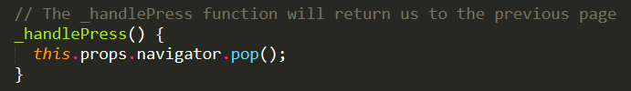

## 21.3 Lesson Plan - React Native & Final Projects

### Overview

After a short lesson on React Native, you'll prime your students to conceptualize their final projects. You'll run down the list of expectations and requirements for each of their weekly deliverables. Aside from that, you and the TAs will stick around to make sure each team has a solid idea for their project--they should have one by the end of the class.

##### Instructor Priorities

* Students should get a basic understanding of how multiple-scene apps and navigation work in React Native.

* Students should know all of their responsibilities for the final project.

* Students should come out of class with a high-level grasp of how their app will function--what does it do and what problem does it solve?

##### Instructor Notes

* **IMPORTANT**: Before class begins, you should initialize a React Native project on your computer with a name the matches the app's -- `MultipleSceneApp` in this case. You'll start the class by showing students the app in action, so best prepare for that now. If you're on windows, make sure you've opened your Android Virtual Device (AVD).

  * Like in the last lecture, use `rninit` to create your directory -- not `react-native`. 
    * This activity was completed with React Native 0.37.0, and it's possible that a newer version of the framework will deprecate important features in our exercise. Using `rninit` will circumvent this.
  * Run this in terminal/bash: 
    * `rninit init MultipleSceneApp --source react-native@0.37.0`
  * Then open [the activity directory](Activities/MultipleSceneApp). Copy into your project directory the index file matching your device emulator (`index.android.js` or `index.ios.js`) as well all of the other files.
  * Run your project to make sure it works: `react-native run-android` or `react-native run-ios`.

* Please review [project resources](../Project-Resources) before class today!

* You should grill students about their ideas. Make sure they don't settle on anything too simplistic or too unrealistic. Their app should fall just slightly above their collective skill level--this will help them grow as developers.

* Keep a list of every group's planned app. Make sure that you wrote down each team's concept before you dismiss the class.

- - -

### Class Objectives

* To give students an understanding of how multiple-scene apps and navigation work in React Native.
* To make sure students know exactly what they have to accomplish each week for their final projects.
* To spur students to figure out what their apps will do.

- - -

### 0. Welcome Class (1 min)

* Say your usual hellos and answer any questions your class might have about past material.

  * Expect a lot of questions from students in your React Native cohort--once again, it's a tough framework.

### 1. Instructor Do: Introduce the New Movie App (10 mins)

* We are going to open today's class with a short lesson on React Native before moving on to final projects. The focus of today's lesson will be on apps with multiple pages or scenes, and how to navigate them.

* The app we created in the last class was great, but most of the apps we use in our everyday lives contain more than one page. Today we are going to be taking a look at a React Native app that uses multiple scenes. This app is a new take on the last one that we worked on — the movie app!

  

* Open the completed app by running `react-native run-android` or `react-native run-ios` and show off it's functionality to the students. Note that our app has three different scenes:

  * The Splash Screen - this is the screen that loads upon running the app.

    

  * The Home Page - this scene allows us to select a movie to get more information about it.

    

  * The Movie Page - this is the scene that will show us more detailed information about a movie.

    

### 2. Everyone Do: Dive into the Code (15 mins)

* Slack out the [completed app](Activities/MultipleSceneApp) to the class and have them follow along with you as you do a quick run-through of the code.

* Open up the project directory and illustrate to the students that in addition to our index file, each of our scenes has its own file. The first page that we are going to take a look at is the index page.

* Open up `index.android.js` or `index.ios.js` in Sublime.

    

  * The first thing you want to draw students' attention to is the `Navigator` component. The `Navigator` is extremely important for this example, because it is responsible for handling the transition between different scenes in our app. In this example, our `Navigator` has three different parts:

    * renderScene - handles how our different scenes are rendered in the app. If we take a look at the render scene function we can see that each scene has it's own unique id, and based on the id that gets passed into the function, a different scene will be rendered. Point out that routes for each of our app's three pages (Splash, Home & Movie) are defined in the renderScene function. We also use route.passProps so that we can pass props from scene to scene. We will discuss this more later.

    * initialRoute - tells our app which route to render first. In this case it will load our splash page.

    * configureScene - allows us to change the animation properties of a scene. If we take a look at the configureScene function, we can see that we are having the scenes transition in by floating from the bottom.

* Next we are going to take a look at the Splash scene. The splash scene is the first one that is rendered when we open our app. Go ahead and open `Splash.js` in Sublime.

    

  * The main things to cover with the splash scene are:

    * We are using `setTimeout` to call the `nextPage` function which will transition to the Home scene 2 seconds after our splash component is mounted.

    * We move to another scene by using `this.props.navigator.push` to push another route to our navigation stack. In this case, the id of the route is 1 which corresponds to the Home route (we can look back to our renderScene function to verify this). If you haven't yet discussed the concept of a stack, now would be a great time. Students can think of the stack as an array where you can only access the last element. Therefore when we push a new scene to our array, it becomes the last element and thusly the scene that is displayed. We can similarly pop elements off of the stack to navigate backwards. We will see an example of this later!

* Next we will take a look at the Home scene. Open up `Home.js` and have the students follow along with you. The most important concept to cover in this file is how we can pass props along to the next scene when we transition.

    

  * In our home scene we have a function press that takes in an argument (which will be the title of a movie). The press function will push a new route to the navigation stack (the individual movie page), and also pass the movie title to the next scene as props.  We will use the movie title in the next scene to make an API call to the OMDB API and populate our page with information.

* Finally, we are going to take a look at the Movie scene. Open up `Movie.js` in Sublime and have the students follow along. This scene mostly reuses code that we saw in our last application. There are two main concepts you will want to touch on when looking at this file:

  * We can access the movie title because it was passed to this scene as props.

  * We can navigate backwards by popping scenes off of the navigation stack!

  

### 3. Students Do: Simple Multi-Scene App (30 mins)

* Take some time to answer any questions students may have about multiple scenes and navigation before moving on.

* For the next 30 or so minutes, task your students with creating a simple multi-scene app from scratch. It doesn't have to be complicated, but it should have at least two scenes and transitions between them. Tell students they can use the code from today's example as a guide if they need help.

### 4. Everyone Do: Review Multi-Scene App (5 mins)

* Once again bring the class together and answer any lingering questions students may have about the concepts covered so far in class. After this we will be moving on to final projects.

### 5. Instructor Do: Encouragement (5 mins)

* We are now going to transition away from React Native, and spend the rest of class discussing final projects.

* Make sure you open up your school's slide on your computer.

* Start presenting the lecture's Power Point. 

* In the first group of slides, you'll congratulate your students for making it as far as they have so far.

  * Remind them that most students had no coding knowhow coming in, but they've learned so much since then (see the list on slide #4).

* Read out some of the goals that your students offered at the beginning of the course (see slide #5).

  * **IMPORTANT**: You should edit this slide to include your own class's objectives.

* When you load slide #6, ask them to think about these questions: did they met their goals yet? Do they see themselves on-route to meeting their ambitions? 
  * Tell them that if their honest answer is yes to either question, then that's fantastic.
  * If it's not, encourage them to speak with you 1:1. Offer your support--work with them to make sure they're confident for the next part of their path as a developer.

### 6. Instructor Do: What's Next? (3 mins)

* You'll explain the next few weeks of classes in the next set of slides.
    
* Tell them about the lectures they can expect, as well as final project presentations and their demo day with potential employers.

* Announce: no homework for the rest of the course! Well, except for:

  * This week's homework (they still gotta hand that one in).
  * Weekly project deliverables -- more on that soon.

* Tell class that their learning doesn't end when they finish the course. There's a literal argosy of languages, frameworks, libraries and other technologies for web developers to study -- and no doubt, this heap of knowledge will build as the years pass. 

* Point being: web developers must always teach themselves new skills to stay relevant in this field! 

* But add in something along these lines. "No problem! If you learned anything in this boot camp, it's how to grasp these technologies quick -- you're ready for this."

### 7. Instructor Do: Final Project - The Deets (10 mins)

* Go over the next set of slides.

* Tell students should challenge themselves, and that you'll take no excuses. They've made it this far already--it's time for them to take everything they learned and produce their best work yet (Slides 12 to 16).

* **Go over what's expected for the project:**

  * Whatever they build should have utility.

  * They should have market or real-world research that proves their idea has REAL value to people. 

  * They should perform research on other web / mobile applications in their app's domain. 

  * They should put serious time and thought into this. 

  * They should report problems they're facing along the way.

  * They should use some form of project management system (Jira, Trello and so on).

  * They should dig deep into documentation and external resources to find the tools they need. 

* **Go over what's required of each group. Each Project:**

  * Must use ReactJS or Angular in some way (even if minimal).

  * Must use a Node and Express Web Server.

  * Must be backed by a MySQL or MongoDB Database with a Sequelize or Mongoose ORM.

  * Must have both GET and POST routes for retrieving and adding new data.

  * Must be deployed using Heroku (with Data).

  * Must utilize at least two libraries, packages, or technologies that we haven’t discussed.

  * Must allow for or involve the authentication of users in some way.

  * Must have a polished frontend / UI.

  * Must have folder structure that meets MVC Paradigm.

  * Must meet good quality coding standards (indentation, scoping, naming).

* **Finally, go over each week's deliverable**

  * **Week 1**: A detailed plan of action with the following:

    * An overview of the intended application and WHY you feel it’s valuable.

    * A breakdown of roles by group member.

    * A schedule for completion of various tasks. 

    * A screenshot of your Jira, Trello, or Project Management Board that shows breakdown of tasks – assigned to group members with a schedule. 

    * A set of DETAILED screen-by-screen design layouts with annotations describing all UI/UX components and all data relevant to the screen.

      * On this note, show Slides 26-27 as an example of a UI/UX and Data Flow layout. Tell the class that you'll expect something akin to these drafts.

  * **Week 2**: A functioning “minimal viable product” (i.e. a prototype version of your app that shows the intended function). This should be as close to a working app as possible and include: 

    * A 5-7 minute presentation that discusses what your app is, what it does, and how it works. You will be presenting to instructors and TAs during class.

    * A screenshot of your Jira, Trello, or Project Management Board that shows breakdown of tasks – assigned to group members with a schedule. This should be updated to reflect remaining priorities and completed tasks.

  * **Week 3**: A significantly more polished version of the app. 

    * This should literally seem like an app that you would submit. 

    * Include a summary of significant issues faced to date and their resolution. 

    * Provide a detailed description of each person’s contributions.

    * Submit a detailed plan that describes remaining efforts. This should describe remaining issues like:
      * Stretch Features
      * Bugs
      * Enhancements
      * UI Polishing 

  * **Week 4**: The Presentation!
    * A 7-10 minute demonstration of your app.
    * More on this as we near closer to the end.

### 8. Students Do: Conceptualize the Final App (42 mins)

* When you close the Power Point, direct your students to form into their groups to think about the app they'll create over the next month. 

* By the time the class ends, they should tell you the following details about their project:
  * What the app will do.
  * What technologies they expect their app to implement.
  * Who will be responsible for each part of the app.
  * Who will be responsible for each part of deliverable #1.

* Record these responses in a list and make sure each group has given you those four items before they leave class.

* As they're thinking about their apps, you and the TAs should walk the classroom and check in on their progress. Once again, make sure they pick something that will challenge them (but not something so ambitious that it will destroy them).

### 9. BREAK (40 mins)

### 10. Students Do: Finish Conceptualizing And Consider the Next Steps (1 hr and 20 mins)

* Continue along the same path as part 8 until class ends.

* Make sure you go to each group that has yet to submit anything about their app and help them figure out the direction they should move in. 
  * If a group can't submit their four items by the end of class, they must at least send them by the end of the day (and really, who wants to work outside of class on a Saturday)?

### Copyright

Coding Boot Camp (C) 2016. All Rights Reserved.
